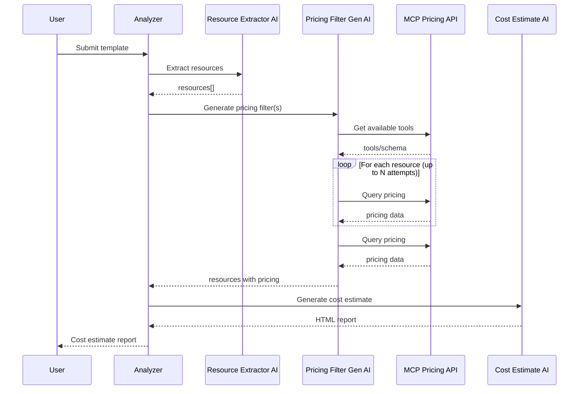

# Azure FinOps AI Cost Analyzer

This project uses Azure AI Foundry to analyze ARM/Terraform templates, extract resources that incur costs, fetch pricing information, and generate human-friendly cost estimates.

## Architecture

The solution consists of three AI flows:

1. **Resource Extraction**: Analyzes ARM/Terraform templates to identify resources that incur costs.
2. **Pricing Lookup**: Retrieves pricing information for the identified resources using Azure Retail Prices API.
3. **Cost Estimation**: Generates a human-friendly cost analysis report with recommendations.

### AI Tool Chaining & Component Interactions

The following diagram illustrates how the main components interact and how AI is used to chain tools together:




- **extractResourcesFromTemplate**: Uses Azure AI to extract resources from the template.
- **generateMcpFilter**: Uses Azure AI to generate a filter for the MCP pricing API.
- **RetailPricesController**: Connects to MCP and fetches pricing using the generated filter.
- **generateCostEstimate**: Uses Azure AI to generate a human-friendly cost report.

This chaining allows the system to go from raw template input to a detailed, human-friendly cost analysis using multiple AI-powered steps and external APIs.


Our original concept was to use agents, but due to time limits we went for an easier more generic apporach using LLM.
You can see the agents architecture at https://www.mermaidchart.com/play#pako:eNp1UctOwzAQ_JVVDggO_QEOSFA4FAGNWuWA2h4WZ5taOLFluwVBkPoh8HP9EvxI1SRtT_Z4Z3bWs98Jkzkl18lSyA-2Qm3haTKvAMz6rdCoVpAZ0jCqLGlklsvKFwGy2W77mykhMYd7Mryodtu_BQwGN3V8reHh0zaS24Iq63VU5f7o9A9FziAVaJdSl7F_TzyLHq3nqFs00xgsKBLDFYYCNV9yhkfUVHPGqyKSG9AlCGRUOtxQ9hDGyvKSfx23nOLGNTGR3wCYEJOl0-WBb1qCJoReDPPkDtm7q8GU9IYzMnD5PEwDIn01T7rjp6PZq1zrPYaLjiEEx3R08POXXqZhWQq1oRw0GdfNmdatLL3mgALdWShBluBxOn6pO2F6dhs3fGOBjAsObWh-krV3B8GNrXsbCIrOS9BIvw0UbvLCfajpnIUSKqXlxtu1N-PrbRyoa-Xicv9XcaRzA_pFMBSibuV_Zq5z1CPr08Tk5x-wPEQ3

## Prerequisites

- Node.js 20+
- Azure OpenAI Service account
- Azure AI Foundry access

## Setup

1. Clone the repository
2. Install dependencies:
   ```
   npm install
   ```
3. Create a `.env` file based on `.env.example` with your Azure OpenAI credentials:
   ```
   # Azure Configuration
   AZURE_INFERENCE_ENDPOINT=your-endpoint-url
   AZURE_INFERENCE_API_KEY=your-api-key
   AZURE_INFERENCE_MODEL_NAME=your-model-name

   # MCP Filter Attempts (number of times to retry MCP AI filter re-generation)
   MCP_FILTER_ATTEMPTS=3
   MCP_URL="http://localhost:8000/retail-prices/mcp/sse"
   MCP_MODE="real"
   ```
## Authentication

The application uses Azure OpenAI SDK v2.0.0 and supports two authentication methods:

1. **API Key Authentication**: Set the `AZURE_OPENAI_API_KEY` in your `.env` file.
2. **Microsoft Entra ID Authentication**: No API key needed. The application will use `DefaultAzureCredential` which supports various credential types (managed identity, environment variables, etc.). To use this method, grant access to your Azure OpenAI resource to your trusted entities.

## Running the Tool

```
npm run dev
```

## How It Works

1. The system takes an ARM or Terraform template as input.
2. Using Azure OpenAI, it extracts all resources that might incur costs.
3. For each resource, it queries the Azure Retail Prices API to get current pricing.
4. Finally, it generates a comprehensive cost analysis report with a summary, detailed breakdown, and optimization recommendations.

## Azure OpenAI Integration

This project uses the latest Azure OpenAI SDK (v2.0.0) which is a companion to the official OpenAI client library for JavaScript. It provides integration with Azure-specific features:

- The `AzureOpenAI` class from the `openai` package with Azure configuration
- Type definitions from `@azure/openai/types`
- Support for Azure AD authentication

## Extending the Tool

You can modify the `src/flows` directory to customize each step of the process:
- `extractResources.ts`: Customize resource extraction logic
- `getPricing.ts`: Modify pricing lookup mechanisms
- `generateCostEstimate.ts`: Adjust cost analysis format and recommendations